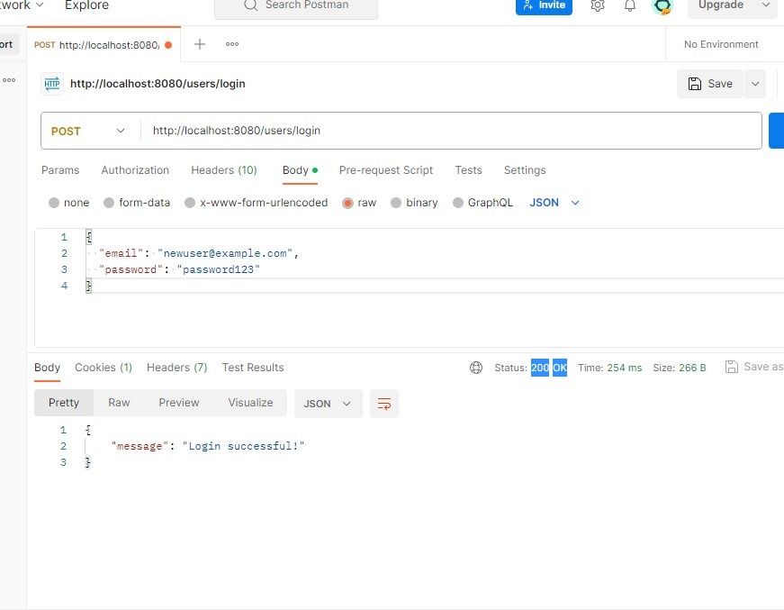
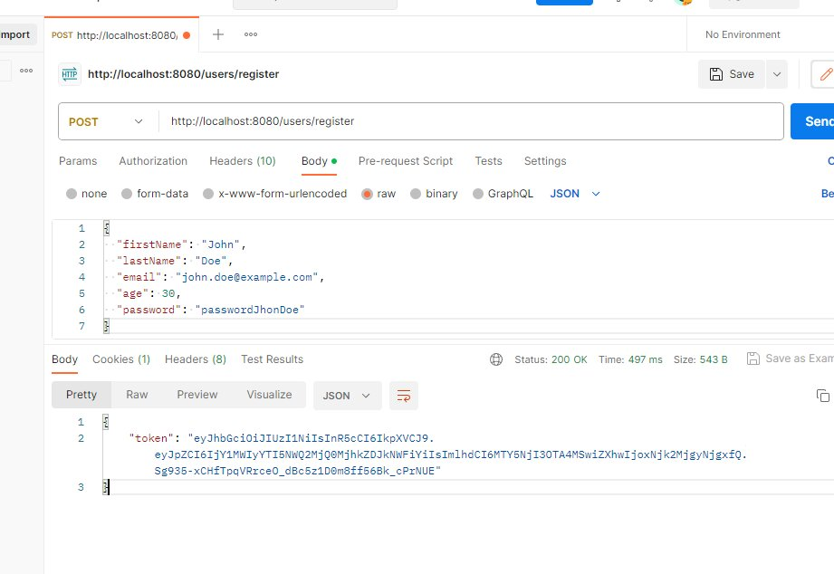
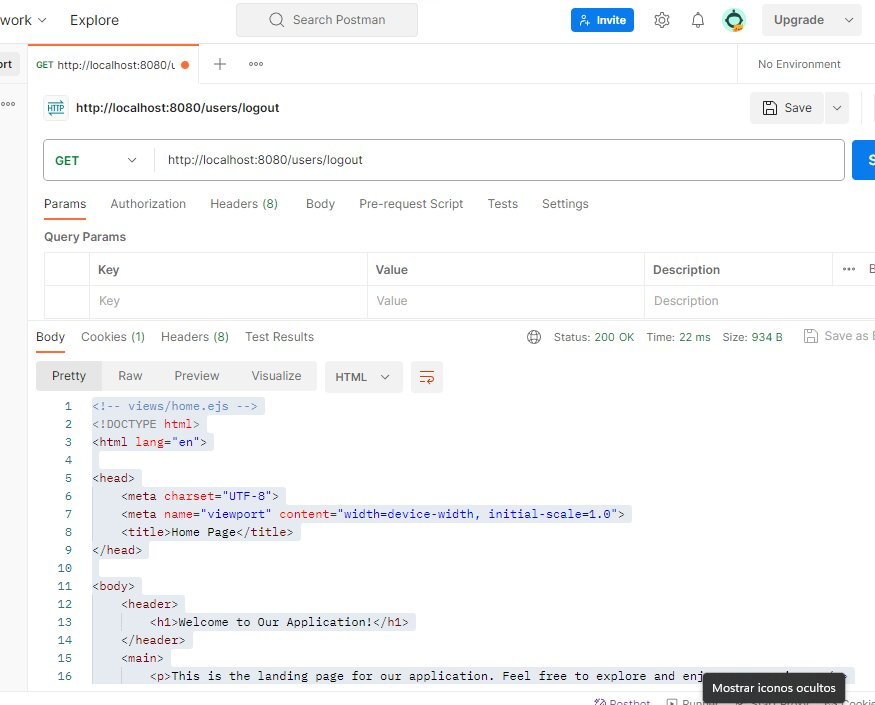

# E-commerce integration practice.

## Overview

This project is dedicated to enhancing the security and user experience of our ecommerce platform by implementing robust authentication mechanisms. We have implemented password hashing using Bcrypt, integrated Passport for seamless registration and login, and facilitated GitHub authentication for user convenience. In addition, we've bolstered security and efficiency through the integration of JSON Web Tokens (JWT), allowing for stateless and secure authentication across the platform. This comprehensive approach ensures a safe, efficient, and user-friendly environment for our users during their ecommerce journey.

## Hashing Passwords using Bcrypt

To enhance security, we use Bcrypt to hash passwords before storing them in the database. This process transforms plain-text passwords into a secure hashed representation. Here's how Bcrypt helps:

- **Hashing**: Bcrypt converts passwords into a hash string, making it computationally intensive for attackers to reverse-engineer the original password.
  
- **Salting**: Bcrypt automatically generates and appends a random "salt" to each password before hashing. This further strengthens the security of the hashed password.

## Implementation of Passport for Register and Login

Passport.js, a widely-used authentication middleware, is implemented for user registration and login processes. Passport provides several strategies for authentication, including local authentication and OAuth. Here's how we use it:

- **Local Authentication**: Passport's local strategy is used for registering and logging in users with their email and password.

- **Middleware Integration**: Passport middleware is integrated into the authentication flow, allowing for efficient and secure user authentication.

- **Customization**: Passport is customized to suit our application's specific authentication needs and provide a seamless experience to users.

## Setup

1. Install the Required Dependencies:

Navigate to the project directory and install the necessary dependencies using npm (Node Package Manager). Run the following command: 
- **cd your-repository npm install**
 
 This will install all the required packages and libraries as specified in the package.json file.

2.  Set Up the Database:

Configure your database settings as per the instructions in the project. Ensure you have a running instance of a database (e.g., MongoDB) and update the configuration accordingly.

3. Start the Server: by running the following command:
- **npm start**
This will initiate the server, and it will start listening on the specified port (usually 8080). You can now access the application by navigating to http://localhost:8080 in your web browser.

4. Open your web browser and enter http://localhost:8080 to access the application. From there, you can register as a new user or log in if you already have an account.

## Endpoints Overview

### 1. Home Page
- **Endpoint:** `/`
- **Method:** GET
- **Description:** Renders the home page view (`views/home.ejs`).

### 2. User Registration
- **Endpoint:** `/register`
- **Method:** POST
- **Description:** Registers a new user by accepting first name, last name, email, age, and password in the request body. It hashes the password and creates a user entry. Generates a JWT token upon successful registration.

### 3. User Login
- **Endpoint:** `/login`
- **Method:** POST
- **Description:** Allows a user to log in by providing their email and password. Compares the provided password with the hashed password stored in the database. If successful, responds with a success message and a JWT token.

### 4. User Logout
- **Endpoint:** `/logout`
- **Method:** GET
- **Description:** Initiates the user logout process by destroying the session. Redirects to the home page upon successful logout.

### 5. Get Current User using JWT
- **Endpoint:** `/api/sessions/current`
- **Method:** GET
- **Description:** Extracts the JWT token from the Authorization header. Verifies the token and fetches the user associated with the token. Responds with the user information or an error message if the token is invalid or no token is found.

## Endpoints Overview

### POST: users/login

### POST: users/register

### GET: users/api/sessions/register

### GET: uusers/logout

## MongoDB Atlas Collections

## Contact

For further inquiries or assistance, please reach out to:

**Lenin Acosta**
- GitHub: [implementacion-login](https://github.com/Leninead/implementacion-login.git)
- LinkedIn: [Profile](https://www.linkedin.com/in/lenin-acosta-b32b8a262/)
- Email: [Lenin Acosta](mailto:leninacosta2107@gmail.com)

